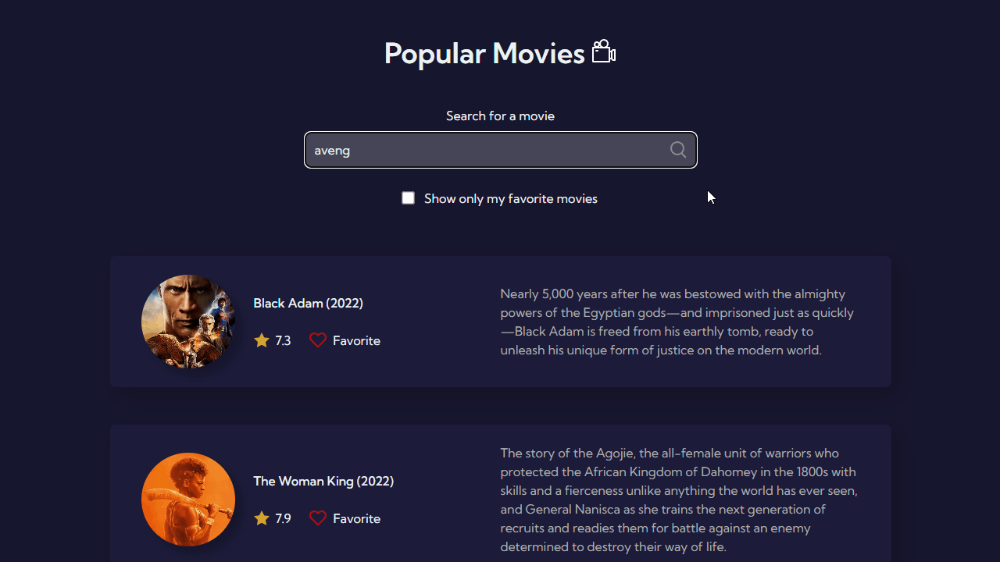
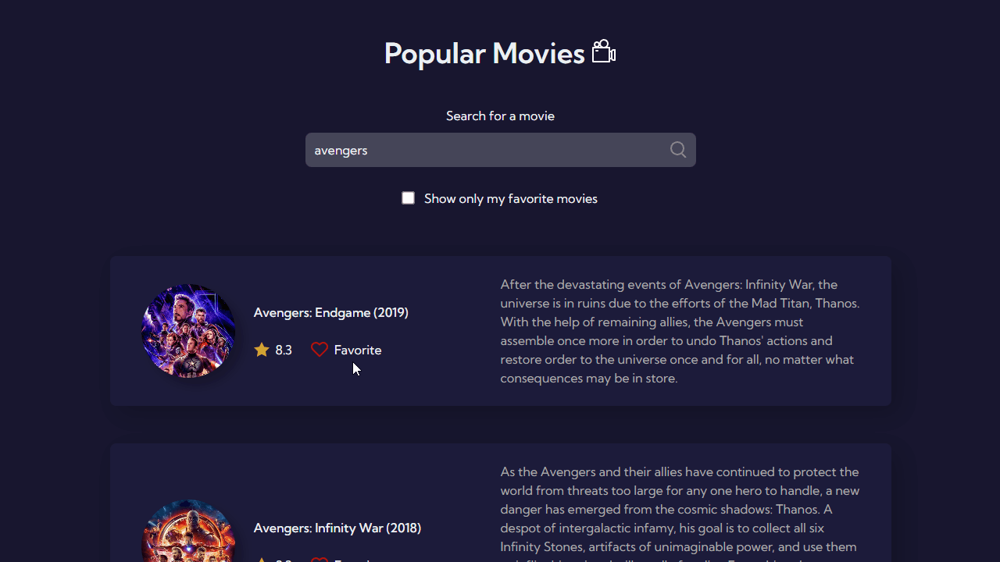

# Popular Movies 🎬

App that displays a list of popular movies using the The Movie Database API. The user can search for movies and mark a movie as a favorite. It was created with HTML, CSS/SASS, and JavaScript.

This project is part of the [7 Days Of Code](https://7daysofcode.io/) Challenge by Alura, a Brazilian learning platform.

## 🔗 Link

- [Deploy](https://julianachagas-popular-movies.netlify.app/)

## 🛠️ Technologies

- HTML
- CSS
- SASS
- JavaScript

## 🌐 API

- [TMDB - The Movie Database API](https://developers.themoviedb.org/3/getting-started/introduction): source of the data and images

## 💡 Features

- List of the current popular movies on TMDB. This list updates daily.
- User is able to search for a movie
- User is able to mark a movie as a favorite
- Option to display only the movies marked as favorites by the user
- The favorite movies are stored in local storage, so the user can leave the page and still have access to the favorite movies when they revisit the page

## 💻 Demo

- List of popular movies

   

- Search for a movie

   

- Mark a movie as a favorite/Show only favorite movies

   

## 📚 Resources

- [Layout on Figma](https://www.figma.com/file/T6KNbp4XRHNImNFczpHVts/Popular-Movies?node-id=0%3A1&t=44OVe48JPQtooW4t-0) by Giovanna Moeller (Alura)

## 👩🏻‍💻 Author

---

##### Made with 💜 by Juliana Chagas
